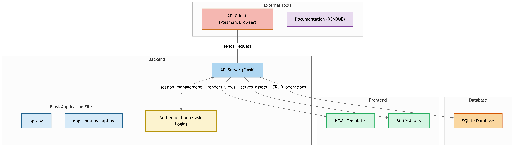

# Time - Sistema de Gerenciamento de Ponto Eletrônico

Este é um sistema de gerenciamento de ponto eletrônico desenvolvido em Python utilizando o framework Flask. O sistema permite gerenciar registros de entrada e saída de funcionários, filtrando os dados por funcionário e evento, e oferecendo uma interface simples e funcional.

> **Aviso**: Aviso: O frontend do sistema foi atualizado, e agora você pode rodar tanto a API quanto o frontend no navegador para interagir com o sistema. Antes, a API (api_backend.py) estava funcionando 100%, mas agora você pode acessar o sistema diretamente pela interface gráfica.

## 🚀 Funcionalidades

- **Cadastro de Pontos**: Registre horários de entrada e saída, associados a funcionários e eventos específicos.
- **Relatório de Pontos**: Exiba e filtre os registros por:
  - Funcionário (nome ou matrícula);
  - Evento (código ou descrição);
  - Combinação de ambos os critérios.
- **Autenticação**: Sistema protegido com autenticação de usuários.

## 🛠️ Tecnologias Utilizadas

- **Backend**: Python com Flask
- **Banco de Dados**: SQLite
- **Frontend**: HTML, CSS e Jinja2
- **Autenticação**: Flask-Login

## ⚙️ Como Instalar e Executar

### Pré-requisitos

- Python 3.10 ou superior
- Ambiente virtual (`virtualenv` ou `venv`)
- SQLite (já integrado ao Python)

### Passos para Execução

1. **Clonar o repositório:**

   ```bash
   git clone https://github.com/seu-usuario/nome-do-repositorio.git
   cd nome-do-repositorio

Criar e ativar o ambiente virtual:

Para criar o ambiente virtual:
```json
python -m venv venv
```

2. **Para ativar o ambiente virtual:**

No Windows:
```json
.\venv\Scripts\activate
```

No Linux ou macOS:
```json
source venv/bin/activate
```

3. **Instalar as dependências:**
```json
pip install -r requirements.txt
```

4. **Rodar o Backend (API)**

Para rodar o projeto, basta executar o arquivo app_backend.py:
```json
python app_backend.py
```

5. **Rodar o Frontend (API)**

O frontend também é um aplicativo Flask. Para rodá-lo, execute o arquivo app_frontend.py (ou outro arquivo Flask que tenha configurado para o frontend):
```json
python app_frontend.py
```

6. **Acessar o Sistema no Navegador**
Abra o navegador de sua preferência e acesse o sistema pelo seguinte link:

Frontend: http://127.0.0.1:5001

Backend (API): http://127.0.0.1:5000 — Utilize para testar diretamente os endpoints da API (se necessário, com ferramentas como Postman ou Insomnia).

Agora, o sistema estará funcionando tanto pela interface web quanto pela API, e você pode gerenciar as funcionalidades diretamente no navegador.

## Diagrama da API


## 📡 Endpoints da API para o Backend

### **/funcionario**
- **POST**: Cadastrar um novo funcionário.
- **GET**: Buscar um funcionário pelo nome ou matrícula.

### **/funcionario/<int:matricula>**
- **DELETE**: Deletar um funcionário pelo número de matrícula.
- **PUT**: Atualizar as informações de um funcionário.
- **GET**: Obter detalhes de um funcionário específico.

### **/funcionarios**
- **GET**: Listar todos os funcionários.

### **/endereco**
- **POST**: Criar um novo endereço.
- **GET**: Listar todos os endereços.

### **/endereco/<int:id>**
- **POST**: Atualizar um endereço específico.
- **GET**: Obter detalhes de um endereço específico.

### **/enderecos**
- **GET**: Listar todos os endereços.

### **/departamento**
- **POST**: Criar um novo departamento.

### **/departamento/<int:id>**
- **POST**: Atualizar um departamento específico.
- **GET**: Obter detalhes de um departamento.

### **/departamento/<int:id>/delete**
- **POST**: Deletar um departamento específico.

### **/departamentos**
- **GET**: Listar todos os departamentos.

### **/funcao**
- **POST**: Criar uma nova função.

### **/funcao/<int:id>**
- **POST**: Atualizar uma função específica.
- **GET**: Obter detalhes de uma função.

### **/funcao/<int:id>/delete**
- **POST**: Deletar uma função específica.

### **/funcoes**
- **GET**: Listar todas as funções.

### **/evento/novo**
- **POST**: Criar um novo evento.

### **/evento/<int:id>**
- **POST**: Atualizar um evento específico.
- **GET**: Obter detalhes de um evento.

### **/evento/<int:id>/delete**
- **POST**: Deletar um evento específico.

### **/eventos**
- **GET**: Listar todos os eventos.

### **/ponto**
- **POST**: Criar um novo ponto de entrada ou saída.
- **GET**: Buscar pontos de acordo com filtros.

### **/ponto/<int:id>**
- **GET**: Obter detalhes de um ponto específico.
- **PUT**: Atualizar um ponto específico.
- **DELETE**: Deletar um ponto específico.

### **/ponto/buscar**
- **POST**: Buscar pontos com critérios de pesquisa específicos.

### **/pontos**
- **GET**: Listar todos os pontos registrados.
- **POST**: Criar um novo ponto.

### **/usuario**
- **POST**: Criar um novo usuário.

### **/usuario/<int:id>**
- **GET**: Obter detalhes de um usuário específico.
- **POST**: Atualizar um usuário específico.

### **/usuario/delete/<int:id>**
- **DELETE**: Deletar um usuário específico.

### **/usuarios**
- **GET**: Listar todos os usuários.

### **/login**
- **GET**: Exibir a tela de login.
- **POST**: Realizar o login de um usuário.
